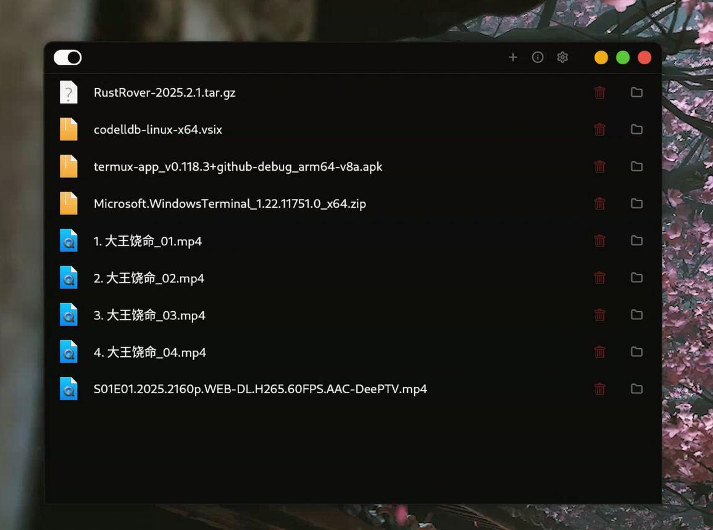
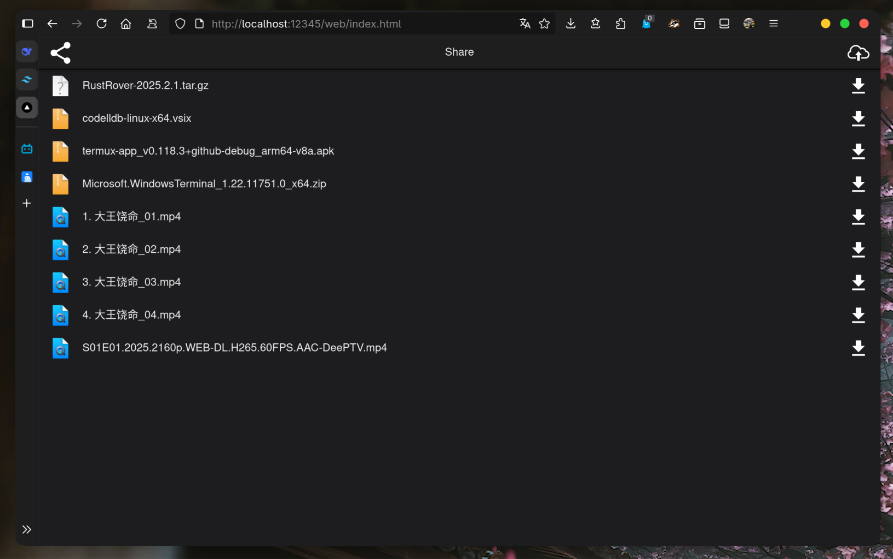
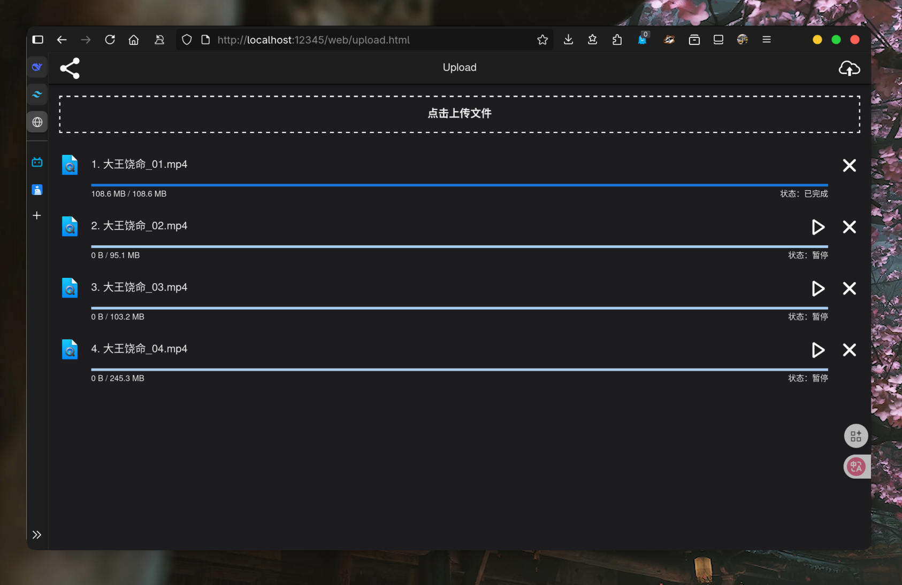

# share-rs

This is a LAN file transfer (sharing) tool that supports file sharding upload and breakpoint resumption.
The backend is developed using rust + GPUI + Actix-web + Sea-ORM, and the frontend is developed with React.

Main interface：

Server information interface: (You can scan the QR code to open the sharing page through the mobile phone browser)

Share Page:

Upload page:
